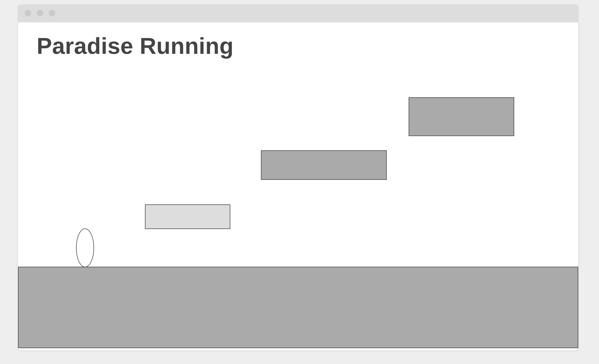

# Paradise Running

[Paradise Running](https://shengzhiluo.github.io/Paradise_Running/) is a single player platform game interactive demo that play around the hills with jumping and running.
Players will be able to tab the keyboard to jump and run, to escape the cliff and gain scores by collecting coins on the way.

## MVP
  1. Players will be able to tab the space and arrow on keyboard.
  2. Players will be able to select different characters and difficulties, wins the scores by collection and the distance they ran.
  3. Game will be finished if player's character fall to the cliff.
  4. There are gonna be random platforms that players can jump on to and random moving cubes between the down hills.
  
## Wirefame

## Technologies 
  * Javascript
  * HTML/CSS
  * Canvas

## Implementation timeline
  * Day 1
    * Basic functionalities, build the canvas.
  * Day 2
    * Build characters and platforms.
  * Day 3
    * Make Movements (Jumping and Running) and coins.
  * Day 4
    * Touching up, smoothing out animations.

